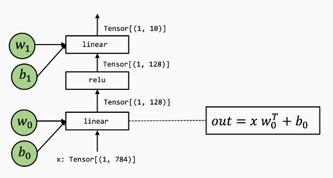
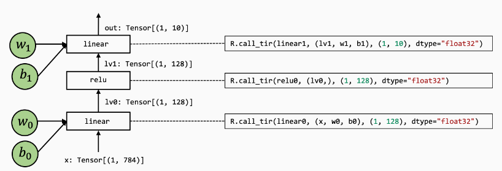

# MLC

课程主页：https://mlc.ai/zh/chapter_introduction/

## Lesson 3 端到端模型执行

### 1 端到端模型整合

示例模型：两层神经网络，包含两个全连接层和一个relu激活层



先从模型的Numpy实现开始：

```python
def numpy_mlp(data, w0, b0, w1, b1):
    lv0 = data @ w0.T + b0
    lv1 = np.maximum(lv0, 0)
    lv2 = lv1 @ w1.T + b1
    return lv2
```

上面的示例代码显示了利用高层NumPy数组操作，执行端到端模型执行的过程。

为了说明底层细节，我们将再次用底层 NumPy 编写示例：

- 我们将在使用循环而不是数组函数来演示循环计算。
- 我们总是通过 `np.empty` 显式分配数组并传递它们。（不包含数组初始化）

下面的代码展示了同一模型的底层Numpy实现：

```python
# 全连接层0
def lnumpy_linear0(X: np.ndarray, W: np.ndarray, B: np.ndarray, Z: np.ndarray):
    Y = np.empty((1, 128), dtype="float32")
    for i in range(1):
        for j in range(128):
            for k in range(784):
                if k == 0:
                    Y[i, j] = 0
                Y[i, j] = Y[i, j] + X[i, k] * W[j, k]

    for i in range(1):
        for j in range(128):
            Z[i, j] = Y[i, j] + B[j]

# relu激活层
def lnumpy_relu0(X: np.ndarray, Y: np.ndarray):
     for i in range(1):
        for j in range(128):
            Y[i, j] = np.maximum(X[i, j], 0)

# 全连接层1
def lnumpy_linear1(X: np.ndarray, W: np.ndarray, B: np.ndarray, Z: np.ndarray):
    Y = np.empty((1, 10), dtype="float32")
    for i in range(1):
        for j in range(10):
            for k in range(128):
                if k == 0:
                    Y[i, j] = 0
                Y[i, j] = Y[i, j] + X[i, k] * W[j, k]

    for i in range(1):
        for j in range(10):
            Z[i, j] = Y[i, j] + B[j]

# 整体模型
def lnumpy_mlp(data, w0, b0, w1, b1):
    lv0 = np.empty((1, 128), dtype="float32")
    lnumpy_linear0(data, w0, b0, lv0)

    lv1 = np.empty((1, 128), dtype="float32")
    lnumpy_relu0(lv0, lv1)

    out = np.empty((1, 10), dtype="float32")
    lnumpy_linear1(lv1, w1, b1, out)
    return out
```

### 2 在TVMScript中构建端到端IRModule

以低级Numpy为示例，现在准备利用MLC抽象来实现端到端模型运行，以下是TVMScript实现

```python
@tvm.script.ir_module
class MyModule:
    @T.prim_func
    def relu0(x: T.handle, y: T.handle):
        n = T.int64()
        X = T.match_buffer(x, (1, n), "float32")
        Y = T.match_buffer(y, (1, n), "float32")
        for i, j in T.grid(1, n):
            with T.block("Y"):
                vi, vj = T.axis.remap("SS", [i, j])
                Y[vi, vj] = T.max(X[vi, vj], T.float32(0))

    @T.prim_func
    def linear0(x: T.handle,
                w: T.handle,
                b: T.handle,
                z: T.handle):
        m, n, k = T.int64(), T.int64(), T.int64()
        X = T.match_buffer(x, (1, m), "float32")
        W = T.match_buffer(w, (n, m), "float32")
        B = T.match_buffer(b, (n, ), "float32")
        Z = T.match_buffer(z, (1, n), "float32")
        Y = T.alloc_buffer((1, n), "float32")
        for i, j, k in T.grid(1, n, m):
            with T.block("Y"):
                vi, vj, vk = T.axis.remap("SSR", [i, j, k])
                with T.init():
                    Y[vi, vj] = T.float32(0)
                Y[vi, vj] = Y[vi, vj] + X[vi, vk] * W[vj, vk]
        for i, j in T.grid(1, n):
            with T.block("Z"):
                vi, vj = T.axis.remap("SS", [i, j])
                Z[vi, vj] = Y[vi, vj] + B[vj]

    @R.function
    def main(x: R.Tensor((1, "m"), "float32"),
             w0: R.Tensor(("n", "m"), "float32"),
             b0: R.Tensor(("n", ), "float32"),
             w1: R.Tensor(("k", "n"), "float32"),
             b1: R.Tensor(("k", ), "float32")):
        m, n, k = T.int64(), T.int64(), T.int64()
        with R.dataflow():
            lv0 = R.call_dps_packed("linear0", (x, w0, b0), R.Tensor((1, n), "float32"))
            lv1 = R.call_dps_packed("relu0", (lv0, ), R.Tensor((1, n), "float32"))
            out = R.call_dps_packed("linear0", (lv1, w1, b1), R.Tensor((1, k), "float32"))
            R.output(out)
        return out
```

对上述程序进行如下**部分**注释：

1. `T.handle`与`T.match_buffer()`：表示数据缓冲区的抽象数据类型，表示一个数据对象但是不会指定其具体的形状、数据类型或内存位置。通过 `T.match_buffer` 函数，可以将抽象的 `T.handle` 转换为具体的 `T.Buffer` 对象。
2. `R.function`：Relax函数是一种表示上层神经网络执行的全新抽象。

### 3 在 TVMScript 中构建端到端 IRModule

#### 3.1 计算图



使用图（graph）来可视化高层模型执行通常很有帮助。上图是main函数的计算图视图：

- 图中的每个框都对应于计算操作。
- 箭头对应于中间张量的输入输出。

图本身可以看作是一种抽象，在机器学习框架中通常称为**计算图 (computational graph)**

#### 3.2 call_dps_packed

计算图中的每个操作步骤都包含一个`R.call_dps_packed`操作。 这是引入元张量函数的过程：

```python
lv0 = R.call_dps_packed("linear0", (x, w0, b0), R.Tensor((1, n), dtype="float32"))
```

为了解释`R.call_dps_packed`，先看一下操作等效底层Numpy实现（参考实现），如下所示：

```python
def lnumpy_call_dps_packed(prim_func, inputs, shape, dtype):
    res = np.empty(shape, dtype=dtype)
    prim_func(*inputs, res)
    return res
```

具体来说，`call_dps_packed`接受一个原函数（prim_func）的输入列表，并分配一个输出张量res，然后将输入和输出传递给prim_func。执行prim_func后，结果会填充到res中，然后返回结果。

为什么需要`call_dps_packed`这样一个函数呢？因为**元张量函数采用以下约定**：

```python
def low_level_prim_func(in0, in1, ..., out):
    # implementations
```

此约定称为：**目标传递（destination passing）**，具体来说，输入和输出**在外部显式分配**并传递给底层元函数。这种风格通常用于底层库设计，因此高层框架可以处理内存分配决策。

**注：**并非所有张量操作都可以通过这种方式呈现（比如，有些操作的输出形状取决于输入。

这里的**关键思想是我们想要隐藏可能的分配或对函数的显式写入**。 用更正式的术语来说，我们希望函数是 **pure** 或 **side-effect free**。如果一个函数只从其输入中读取并通过其输出返回结果，它不会改变程序的其他部分（例如递增全局计数器），那么它是**pure**或**side-effect free**的。

我们可以据此将底层Numpy代码重写为：

```python
def lnumpy_mlp_with_call_dps_packed(data, w0, b0, w1, b1):
    lv0 = lnumpy_call_dps_packed(lnumpy_linear0, (data, w0, b0), (1, 128), dtype="float32")
    lv1 = lnumpy_call_dps_packed(lnumpy_relu0, (lv0, ), (1, 128), dtype="float32")
    out = lnumpy_call_dps_packed(lnumpy_linear1, (lv1, w1, b1), (1, 10), dtype="float32")
    return out
```

#### 3.4 Dataflow Block

dataflow block是我们标记程序计算图区域的一种方式。 具体来说，在dataflow block中，所有操作都需要side-effect free。 在dataflow block之外，操作可能包含side-effect。示例如下：

```python
@R.function
def main(x: R.Tensor((1, "m"), "float32"),
        w0: R.Tensor(("n", "m"), "float32"),
        b0: R.Tensor(("n", ), "float32"),
        w1: R.Tensor(("k", "n"), "float32"),
        b1: R.Tensor(("k", ), "float32")):
    m, n, k = T.int64(), T.int64(), T.int64()

    with R.dataflow():
        lv0 = R.call_dps_packed("linear0", (x, w0, b0), R.Tensor((1, n), "float32"))
        gv0 = R.call_dps_packed("relu0", (lv0, ), R.Tensor((1, n), "float32"))
        R.output(gv0)

    with R.dataflow():
        out = R.call_dps_packed("linear0", (gv0, w1, b1), R.Tensor((1, k), "float32"))
        R.output(out)
    return out
```

### 4 构建并运行模型

调用 `relax.build` 来构建这个函数。 注意：Relax 仍在开发中，因此某些 API 可能会更改。 不过，我们的主要目标是熟悉端到端模型的整体 MLC 流程**（构造、转换、构建）**。

```python
ex = relax.build(MyModule, target="llvm")
```

build 函数会给我们一个可执行文件（译者注：“可执行文件”并非传统操作系统中的可执行文件，不能直接在系统中运行，而是针对Relax VM设计的一种文件格式）。

```python
vm = relax.VirtualMachine(ex, tvm.cpu())
```

首先构建包含输入数据和权重的 tvm NDArray，然后我们可以通过传入输入参数和权重来运行 `main` 函数。

```
data_nd = tvm.nd.array(img.reshape(1, 784))
nd_params = {k: tvm.nd.array(v) for k, v in mlp_params.items()}

nd_res = vm["main"](data_nd,
                    nd_params["w0"],
                    nd_params["b0"],
                    nd_params["w1"],
                    nd_params["b1"])
                    
print(nd_res)
```

### 5 在环境中集成现有运行库

很多情况下，我们希望将现有的库函数集成到MLC过程中

以下示例IRModule展示了如何做到这一点：

```python
@tvm.script.ir_module
class MyModuleWithExternCall:
    @R.function
    def main(x: R.Tensor((1, "m"), "float32"),
             w0: R.Tensor(("n", "m"), "float32"),
             b0: R.Tensor(("n", ), "float32"),
             w1: R.Tensor(("k", "n"), "float32"),
             b1: R.Tensor(("k", ), "float32")):
        # block 0
        m, n, k = T.int64(), T.int64(), T.int64()
        with R.dataflow():
            lv0 = R.call_dps_packed("env.linear", (x, w0, b0), R.Tensor((1, n), "float32"))
            lv1 = R.call_dps_packed("env.relu", (lv0, ), R.Tensor((1, n), "float32"))
            out = R.call_dps_packed("env.linear", (lv1, w1, b1), R.Tensor((1, k), "float32"))
            R.output(out)
        return out
```

现在我们直接在`call_dps_packed`中传入字符串

```python
R.call_dps_packed("env.linear", (x, w0, b0), R.Tensor((1, n), "float32"))
```

这些字符串是我们期望在模型执行期间的运行函数（runtime function）的名称。

#### 5.1 注册运行时函数

为了能够执行调用外部函数的代码，我们需要注册相应的函数。下面的代码注册了函数的两个实现：

```python
@tvm.register_func("env.linear", override=True)
def torch_linear(x: tvm.nd.NDArray,
                 w: tvm.nd.NDArray,
                 b: tvm.nd.NDArray,
                 out: tvm.nd.NDArray):
    x_torch = torch.from_dlpack(x)
    w_torch = torch.from_dlpack(w)
    b_torch = torch.from_dlpack(b)
    out_torch = torch.from_dlpack(out)
    torch.mm(x_torch, w_torch.T, out=out_torch)
    torch.add(out_torch, b_torch, out=out_torch)

@tvm.register_func("env.relu", override=True)
def lnumpy_relu(x: tvm.nd.NDArray,
                out: tvm.nd.NDArray):
    x_torch = torch.from_dlpack(x)
    out_torch = torch.from_dlpack(out)
    torch.maximum(x_torch, torch.Tensor([0.0]), out=out_torch)
```

代码注解：

1. `from_dlpack` 将 TVM NDArray 转换为 torch NDArray。 请注意，这是一个零拷贝转换，这意味着 Torch 阵列与 TVM NDArray 共享底层内存。
2. DLPack 是一种通用的交换标准，允许不同的框架交换 Tensor/NDArray 而无需参与数据复制。 

#### 5.2 构建和运行

现在我们可以构建并运行`MyModuleWithExternCall`，我们可以验证模型得到了相同的结果。

```python
ex = relax.build(MyModuleWithExternCall, target="llvm")
vm = relax.VirtualMachine(ex, tvm.cpu())

nd_res = vm["main"](data_nd,
                    nd_params["w0"],
                    nd_params["b0"],
                    nd_params["w1"],
                    nd_params["b1"])

pred_kind = np.argmax(nd_res.numpy(), axis=1)
print("MyModuleWithExternCall Prediction:", class_names[pred_kind[0]])
```

### 6 混合TensorIR Code和库

在上一个示例中，我们构建了一个IRModule，其中所有的元操作都被分派给运行库。有时将两者混合使用会有所帮助。

```python
@tvm.script.ir_module
class MyModuleMixture:
    @T.prim_func
    def linear0(x: T.handle,
                w: T.handle,
                b: T.handle,
                z: T.handle):
        m, n, k = T.int64(), T.int64(), T.int64()
        X = T.match_buffer(x, (1, m), "float32")
        W = T.match_buffer(w, (n, m), "float32")
        B = T.match_buffer(b, (n, ), "float32")
        Z = T.match_buffer(z, (1, n), "float32")
        Y = T.alloc_buffer((1, n), "float32")
        for i, j, k in T.grid(1, n, m):
            with T.block("Y"):
                vi, vj, vk = T.axis.remap("SSR", [i, j, k])
                with T.init():
                    Y[vi, vj] = T.float32(0)
                Y[vi, vj] = Y[vi, vj] + X[vi, vk] * W[vj, vk]
        for i, j in T.grid(1, n):
            with T.block("Z"):
                vi, vj = T.axis.remap("SS", [i, j])
                Z[vi, vj] = Y[vi, vj] + B[vj]

    @R.function
    def main(x: R.Tensor((1, "m"), "float32"),
             w0: R.Tensor(("n", "m"), "float32"),
             b0: R.Tensor(("n", ), "float32"),
             w1: R.Tensor(("k", "n"), "float32"),
             b1: R.Tensor(("k", ), "float32")):
        m, n, k = T.int64(), T.int64(), T.int64()
        with R.dataflow():
            lv0 = R.call_dps_packed("linear0", (x, w0, b0), R.Tensor((1, n), "float32"))
            lv1 = R.call_dps_packed("env.relu", (lv0, ), R.Tensor((1, n), "float32"))
            out = R.call_dps_packed("env.linear", (lv1, w1, b1), R.Tensor((1, k), "float32"))
            R.output(out)
        return out
```

### 7 将参数绑定到IRModule

在到目前为止的所有示例中，我们通过**显式传递参数来构造主函数**。 在许多情况下，**将参数绑定为附加到 IRModule 的常量**通常会降低API的复杂程度。 

前置代码：

```python
mlp_params = pkl.load(open("fasionmnist_mlp_params.pkl", "rb"))
nd_params = {k: tvm.nd.array(v) for k, v in mlp_params.items()}
```

以下代码通过将参数名称与 nd_params 中的键匹配来创建绑定。

```python
MyModuleWithParams = relax.transform.BindParams("main", nd_params)(MyModuleMixture)
IPython.display.Code(MyModuleWithParams.script(), language="python")
```

结果如下：

```python
# from tvm.script import ir as I
# from tvm.script import tir as T
# from tvm.script import relax as R

@I.ir_module
class Module:
    @T.prim_func
    def linear0(x: T.handle, w: T.handle, b: T.handle, z: T.handle):
        m = T.int64()
        X = T.match_buffer(x, (1, m))
        n = T.int64()
        W = T.match_buffer(w, (n, m))
        B = T.match_buffer(b, (n,))
        Z = T.match_buffer(z, (1, n))
        # with T.block("root"):
        Y = T.alloc_buffer((1, n))
        for i, j, k in T.grid(1, n, m):
            with T.block("Y"):
                vi, vj, vk = T.axis.remap("SSR", [i, j, k])
                T.reads(X[vi, vk], W[vj, vk])
                T.writes(Y[vi, vj])
                with T.init():
                    Y[vi, vj] = T.float32(0)
                Y[vi, vj] = Y[vi, vj] + X[vi, vk] * W[vj, vk]
        for i, j in T.grid(1, n):
            with T.block("Z"):
                vi, vj = T.axis.remap("SS", [i, j])
                T.reads(Y[vi, vj], B[vj])
                T.writes(Z[vi, vj])
                Z[vi, vj] = Y[vi, vj] + B[vj]

    @R.function
    def main(x: R.Tensor((1, 784), dtype="float32")) -> R.Tensor((1, 10), dtype="float32"):
        with R.dataflow():
            lv0 = R.call_dps_packed("linear0", (x, metadata["relax.expr.Constant"][0], metadata["relax.expr.Constant"][1]), out_sinfo=R.Tensor((1, 128), dtype="float32"))
            lv1 = R.call_dps_packed("env.relu", (lv0,), out_sinfo=R.Tensor((1, 128), dtype="float32"))
            out = R.call_dps_packed("env.linear", (lv1, metadata["relax.expr.Constant"][2], metadata["relax.expr.Constant"][3]), out_sinfo=R.Tensor((1, 10), dtype="float32"))
            R.output(out)
        return out
# Metadata omitted. Use show_meta=True in script() method to show it.
```

其中如果要展示Metadata，可以这样写

```python
MyModuleWithParams = relax.transform.BindParams("main", nd_params)(MyModuleMixture)
script_with_meta = MyModuleWithParams.script(show_meta=True)
print(script_with_meta)
```

### 8 作业：从Pytorch迁移模型

需要的头文件

```python
import numpy as np
import pickle as pkl
import torch
import torch.nn.functional as F
import torchvision
import tvm
import tvm.testing

from matplotlib import pyplot as plt
from torch import nn
from torchvision import transforms
from tvm import topi, relax, te
from tvm.script import tir as T
```

#### 8.1 构建端到端的模型

TVM提供了一个类``relax.BlockBuilder`能够从空白的IRMoudle开始一步步的构建端到端的模型，这里的“block”值得是就是Relax函数中的DataFlow Block。

具体而言，在`BlockBuilder`中我们有一个`emit_te`的API，它可以**将一个张量表达式的算子描述转变成一个对应TensorIR函数的`call_tir`操作**，与手工写TensorIR函数相比减少了工作量。

```
# func是返回一个张量表达式函数，*input是func的输入
emit_te(func, *input)
```

**示例**：以relu函数为例

```python
def relu(A):
    B = te.compute(shape=(128, 128), fcompute=lambda i, j: te.max(A[i, j], 0), name="B")
    return B

def emit_te_example():
    bb = relax.BlockBuilder()
    shape = (128, 128)
    dtype = "float32"
    x_struct_info = relax.TensorStructInfo(shape, dtype)
    x = relax.Var("x", x_struct_info)
    with bb.function("main", [x]):
        with bb.dataflow():
            lv0 = bb.emit_te(relu, x)
            gv = bb.emit_output(lv0)
        bb.emit_func_output(gv)
    return bb.get()
```

代码解释如下：

1. `with bb.function(name, [*input])`API构建一个以x为输入的Relax函数`main`。
2. 之后构建一个dataflow block
   1. 首先使用`emit_te`生成一个调用ReLU算子的`call_tir`，这里的`emit_te`在IRModule中生成了一个名字为`relu`的TensorIR函数
   2. 然后在dataflow block中生成`call_tir(relu, (x,), (128, 128), dtype="float32")`操作
3. 在这一构造之后，BlockBuilder实例`bb`包含构建完的IRModule，它可以通过`bb.get()`得到。

#### 8.2 端到端模型中的程序变换

这次关注的算子是：conv2d（二维卷积）

介绍两个新的原语：

- `compute_inline`：将一个block内联到另一个block中，以减少内存使用大小和内存访问次数
- `fuse`：和`split`相对。融合多个轴。这里的`fuse`与`parallel`/`vectorize`/`unroll`一起使用，以增加并行度。

**示例1 compute_inline：**

```python
@T.prim_func
def before_inline(a: T.handle, c: T.handle) -> None:
    A = T.match_buffer(a, (128, 128))
    B = T.alloc_buffer((128, 128))
    C = T.match_buffer(c, (128, 128))
    for i, j in T.grid(128, 128):
        with T.block("B"):
            vi, vj = T.axis.remap("SS", [i, j])
            B[vi, vj] = A[vi, vj] * 2.0
    for i, j in T.grid(128, 128):
        with T.block("C"):
            vi, vj = T.axis.remap("SS", [i, j])
            C[vi, vj] = B[vi, vj] + 1.0


sch = tvm.tir.Schedule(before_inline)
IPython.display.Code(sch.mod["main"].script(), language="python")
```

得到的结果为：

```python
# from tvm.script import tir as T

@T.prim_func
def before_inline(A: T.Buffer((128, 128), "float32"), C: T.Buffer((128, 128), "float32")):
    # with T.block("root"):
    B = T.alloc_buffer((128, 128))
    for i, j in T.grid(128, 128):
        with T.block("B"):
            vi, vj = T.axis.remap("SS", [i, j])
            T.reads(A[vi, vj])
            T.writes(B[vi, vj])
            B[vi, vj] = A[vi, vj] * T.float32(2)
    for i, j in T.grid(128, 128):
        with T.block("C"):
            vi, vj = T.axis.remap("SS", [i, j])
            T.reads(B[vi, vj])
            T.writes(C[vi, vj])
            C[vi, vj] = B[vi, vj] + T.float32(1)
```

进行`compute_inline`变换后：

```python
sch.compute_inline(sch.get_block("B"))
IPython.display.Code(sch.mod["main"].script(), language="python")
```

```python
# from tvm.script import tir as T

@T.prim_func
def before_inline(A: T.Buffer((128, 128), "float32"), C: T.Buffer((128, 128), "float32")):
    # with T.block("root"):
    for i, j in T.grid(128, 128):
        with T.block("C"):
            vi, vj = T.axis.remap("SS", [i, j])
            T.reads(A[vi, vj])
            T.writes(C[vi, vj])
            C[vi, vj] = A[vi, vj] * T.float32(2) + T.float32(1)
```

**示例2 fuse**：

```python
@T.prim_func
def before_fuse(a: T.handle, b: T.handle) -> None:
    A = T.match_buffer(a, (128, 128))
    B = T.match_buffer(b, (128, 128))
    for i, j in T.grid(128, 128):
        with T.block("B"):
            vi, vj = T.axis.remap("SS", [i, j])
            B[vi, vj] = A[vi, vj] * 2.0


sch = tvm.tir.Schedule(before_fuse)
IPython.display.Code(sch.mod["main"].script(), language="python")
```

得到的结果为：

```python
# from tvm.script import tir as T

@T.prim_func
def before_fuse(A: T.Buffer((128, 128), "float32"), B: T.Buffer((128, 128), "float32")):
    # with T.block("root"):
    for i, j in T.grid(128, 128):
        with T.block("B"):
            vi, vj = T.axis.remap("SS", [i, j])
            T.reads(A[vi, vj])
            T.writes(B[vi, vj])
            B[vi, vj] = A[vi, vj] * T.float32(2)
```

进行`fuse`后：

```python
i, j = sch.get_loops(sch.get_block("B"))
sch.fuse(i, j)
IPython.display.Code(sch.mod["main"].script(), language="python")
```

```python
# from tvm.script import tir as T

@T.prim_func
def before_fuse(A: T.Buffer((128, 128), "float32"), B: T.Buffer((128, 128), "float32")):
    # with T.block("root"):
    for i_j_fused in range(16384):
        with T.block("B"):
            vi = T.axis.spatial(128, i_j_fused // 128)
            vj = T.axis.spatial(128, i_j_fused % 128)
            T.reads(A[vi, vj])
            T.writes(B[vi, vj])
            B[vi, vj] = A[vi, vj] * T.float32(2)
```

