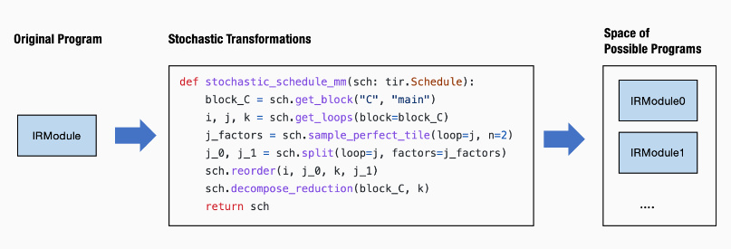
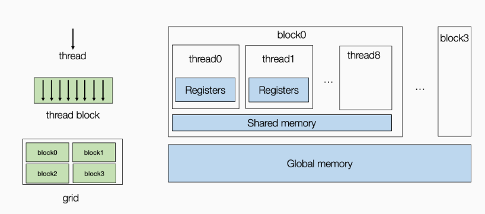
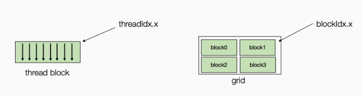
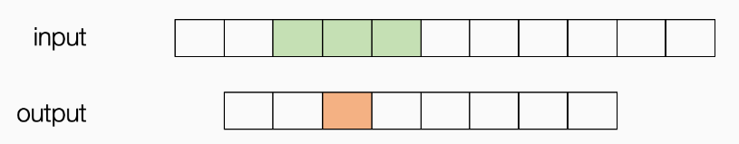
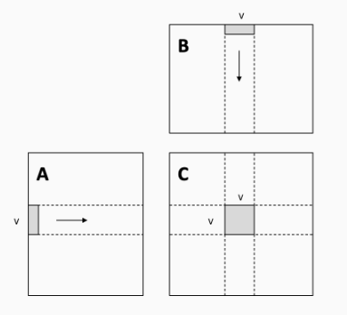
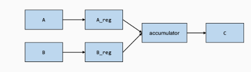

# MLC

课程主页：https://mlc.ai/zh/chapter_introduction/

## Lesson3 端到端模型执行

### 1 端到端模型整合

示例模型：两层神经网络，包含两个全连接层和一个relu激活层


先从模型的Numpy实现开始：

```python
def numpy_mlp(data, w0, b0, w1, b1):
    lv0 = data @ w0.T + b0
    lv1 = np.maximum(lv0, 0)
    lv2 = lv1 @ w1.T + b1
    return lv2
```

上面的示例代码显示了利用高层NumPy数组操作，执行端到端模型执行的过程。

为了说明底层细节，我们将再次用底层 NumPy 编写示例：

- 我们将在使用循环而不是数组函数来演示循环计算。
- 我们总是通过 `np.empty` 显式分配数组并传递它们。（不包含数组初始化）

下面的代码展示了同一模型的底层Numpy实现：

```python
# 全连接层0
def lnumpy_linear0(X: np.ndarray, W: np.ndarray, B: np.ndarray, Z: np.ndarray):
    Y = np.empty((1, 128), dtype="float32")
    for i in range(1):
        for j in range(128):
            for k in range(784):
                if k == 0:
                    Y[i, j] = 0
                Y[i, j] = Y[i, j] + X[i, k] * W[j, k]

    for i in range(1):
        for j in range(128):
            Z[i, j] = Y[i, j] + B[j]

# relu激活层
def lnumpy_relu0(X: np.ndarray, Y: np.ndarray):
     for i in range(1):
        for j in range(128):
            Y[i, j] = np.maximum(X[i, j], 0)

# 全连接层1
def lnumpy_linear1(X: np.ndarray, W: np.ndarray, B: np.ndarray, Z: np.ndarray):
    Y = np.empty((1, 10), dtype="float32")
    for i in range(1):
        for j in range(10):
            for k in range(128):
                if k == 0:
                    Y[i, j] = 0
                Y[i, j] = Y[i, j] + X[i, k] * W[j, k]

    for i in range(1):
        for j in range(10):
            Z[i, j] = Y[i, j] + B[j]

# 整体模型
def lnumpy_mlp(data, w0, b0, w1, b1):
    lv0 = np.empty((1, 128), dtype="float32")
    lnumpy_linear0(data, w0, b0, lv0)

    lv1 = np.empty((1, 128), dtype="float32")
    lnumpy_relu0(lv0, lv1)

    out = np.empty((1, 10), dtype="float32")
    lnumpy_linear1(lv1, w1, b1, out)
    return out
```

### 2 在TVMScript中构建端到端IRModule

以低级Numpy为示例，现在准备利用MLC抽象来实现端到端模型运行，以下是TVMScript实现

```python
@tvm.script.ir_module
class MyModule:
    @T.prim_func
    def relu0(x: T.handle, y: T.handle):
        n = T.int64()
        X = T.match_buffer(x, (1, n), "float32")
        Y = T.match_buffer(y, (1, n), "float32")
        for i, j in T.grid(1, n):
            with T.block("Y"):
                vi, vj = T.axis.remap("SS", [i, j])
                Y[vi, vj] = T.max(X[vi, vj], T.float32(0))

    @T.prim_func
    def linear0(x: T.handle,
                w: T.handle,
                b: T.handle,
                z: T.handle):
        m, n, k = T.int64(), T.int64(), T.int64()
        X = T.match_buffer(x, (1, m), "float32")
        W = T.match_buffer(w, (n, m), "float32")
        B = T.match_buffer(b, (n, ), "float32")
        Z = T.match_buffer(z, (1, n), "float32")
        Y = T.alloc_buffer((1, n), "float32")
        for i, j, k in T.grid(1, n, m):
            with T.block("Y"):
                vi, vj, vk = T.axis.remap("SSR", [i, j, k])
                with T.init():
                    Y[vi, vj] = T.float32(0)
                Y[vi, vj] = Y[vi, vj] + X[vi, vk] * W[vj, vk]
        for i, j in T.grid(1, n):
            with T.block("Z"):
                vi, vj = T.axis.remap("SS", [i, j])
                Z[vi, vj] = Y[vi, vj] + B[vj]

    @R.function
    def main(x: R.Tensor((1, "m"), "float32"),
             w0: R.Tensor(("n", "m"), "float32"),
             b0: R.Tensor(("n", ), "float32"),
             w1: R.Tensor(("k", "n"), "float32"),
             b1: R.Tensor(("k", ), "float32")):
        m, n, k = T.int64(), T.int64(), T.int64()
        with R.dataflow():
            lv0 = R.call_dps_packed("linear0", (x, w0, b0), R.Tensor((1, n), "float32"))
            lv1 = R.call_dps_packed("relu0", (lv0, ), R.Tensor((1, n), "float32"))
            out = R.call_dps_packed("linear0", (lv1, w1, b1), R.Tensor((1, k), "float32"))
            R.output(out)
        return out
```

对上述程序进行如下**部分**注释：

1. `T.handle`与`T.match_buffer()`：表示数据缓冲区的抽象数据类型，表示一个数据对象但是不会指定其具体的形状、数据类型或内存位置。通过 `T.match_buffer` 函数，可以将抽象的 `T.handle` 转换为具体的 `T.Buffer` 对象。
2. `R.function`：Relax函数是一种表示上层神经网络执行的全新抽象。

### 3 在 TVMScript 中构建端到端 IRModule

#### 3.1 计算图


使用图（graph）来可视化高层模型执行通常很有帮助。上图是main函数的计算图视图：

- 图中的每个框都对应于计算操作。
- 箭头对应于中间张量的输入输出。

图本身可以看作是一种抽象，在机器学习框架中通常称为**计算图 (computational graph)**

#### 3.2 call_dps_packed

计算图中的每个操作步骤都包含一个`R.call_dps_packed`操作。 这是引入元张量函数的过程：

```python
lv0 = R.call_dps_packed("linear0", (x, w0, b0), R.Tensor((1, n), dtype="float32"))
```

为了解释`R.call_dps_packed`，先看一下操作等效底层Numpy实现（参考实现），如下所示：

```python
def lnumpy_call_dps_packed(prim_func, inputs, shape, dtype):
    res = np.empty(shape, dtype=dtype)
    prim_func(*inputs, res)
    return res
```

具体来说，`call_dps_packed`接受一个原函数（prim_func）的输入列表，并分配一个输出张量res，然后将输入和输出传递给prim_func。执行prim_func后，结果会填充到res中，然后返回结果。

为什么需要`call_dps_packed`这样一个函数呢？因为**元张量函数采用以下约定**：

```python
def low_level_prim_func(in0, in1, ..., out):
    # implementations
```

此约定称为：**目标传递（destination passing）**，具体来说，输入和输出**在外部显式分配**并传递给底层元函数（即代码中的`prim_func`）。这种风格通常用于底层库设计，因此高层框架可以处理内存分配决策。

**注：**并非所有张量操作都可以通过这种方式呈现（比如，有些操作的输出形状取决于输入）

这里的**关键思想是我们想要隐藏可能的分配或对函数的显式写入**。 用更正式的术语来说，我们希望函数是 **pure** 或 **side-effect free**。如果一个函数只从其输入中读取并通过其输出返回结果，它不会改变程序的其他部分（例如递增全局计数器），那么它是**pure**或**side-effect free**的。

我们可以据此将底层Numpy代码重写为：

```python
def lnumpy_mlp_with_call_dps_packed(data, w0, b0, w1, b1):
    lv0 = lnumpy_call_dps_packed(lnumpy_linear0, (data, w0, b0), (1, 128), dtype="float32")
    lv1 = lnumpy_call_dps_packed(lnumpy_relu0, (lv0, ), (1, 128), dtype="float32")
    out = lnumpy_call_dps_packed(lnumpy_linear1, (lv1, w1, b1), (1, 10), dtype="float32")
    return out
```

#### 3.4 Dataflow Block

dataflow block是我们标记程序计算图区域的一种方式。 具体来说，在dataflow block中，所有操作都需要side-effect free。 在dataflow block之外，操作可能包含side-effect。示例如下：

```python
@R.function
def main(x: R.Tensor((1, "m"), "float32"),
        w0: R.Tensor(("n", "m"), "float32"),
        b0: R.Tensor(("n", ), "float32"),
        w1: R.Tensor(("k", "n"), "float32"),
        b1: R.Tensor(("k", ), "float32")):
    m, n, k = T.int64(), T.int64(), T.int64()

    with R.dataflow():
        lv0 = R.call_dps_packed("linear0", (x, w0, b0), R.Tensor((1, n), "float32"))
        gv0 = R.call_dps_packed("relu0", (lv0, ), R.Tensor((1, n), "float32"))
        R.output(gv0)

    with R.dataflow():
        out = R.call_dps_packed("linear0", (gv0, w1, b1), R.Tensor((1, k), "float32"))
        R.output(out)
    return out
```

### 4 构建并运行模型

调用 `relax.build` 来构建这个函数。 **注意：Relax 仍在开发中，因此某些 API 可能会更改。** 不过，我们的主要目标是熟悉端到端模型的整体 MLC 流程**（构造、转换、构建）**。

```python
ex = relax.build(MyModule, target="llvm")
```

build 函数会给我们一个可执行文件（译者注：“可执行文件”并非传统操作系统中的可执行文件，不能直接在系统中运行，而是针对Relax VM设计的一种文件格式）。

```python
vm = relax.VirtualMachine(ex, tvm.cpu())
```

首先构建包含输入数据和权重的 tvm NDArray，然后我们可以通过传入输入参数和权重来运行 `main` 函数。

```
data_nd = tvm.nd.array(img.reshape(1, 784))
nd_params = {k: tvm.nd.array(v) for k, v in mlp_params.items()}

nd_res = vm["main"](data_nd,
                    nd_params["w0"],
                    nd_params["b0"],
                    nd_params["w1"],
                    nd_params["b1"])
                    
print(nd_res)
```

### 5 在环境中集成现有运行库

很多情况下，我们希望将现有的库函数集成到MLC过程中

以下示例IRModule展示了如何做到这一点：

```python
@tvm.script.ir_module
class MyModuleWithExternCall:
    @R.function
    def main(x: R.Tensor((1, "m"), "float32"),
             w0: R.Tensor(("n", "m"), "float32"),
             b0: R.Tensor(("n", ), "float32"),
             w1: R.Tensor(("k", "n"), "float32"),
             b1: R.Tensor(("k", ), "float32")):
        # block 0
        m, n, k = T.int64(), T.int64(), T.int64()
        with R.dataflow():
            lv0 = R.call_dps_packed("env.linear", (x, w0, b0), R.Tensor((1, n), "float32"))
            lv1 = R.call_dps_packed("env.relu", (lv0, ), R.Tensor((1, n), "float32"))
            out = R.call_dps_packed("env.linear", (lv1, w1, b1), R.Tensor((1, k), "float32"))
            R.output(out)
        return out
```

现在我们直接在`call_dps_packed`中传入字符串

```python
R.call_dps_packed("env.linear", (x, w0, b0), R.Tensor((1, n), "float32"))
```

这些字符串是我们期望在模型执行期间的运行函数（runtime function）的名称。

#### 5.1 注册运行时函数

为了能够执行调用外部函数的代码，我们需要注册相应的函数。下面的代码注册了函数的两个实现：

```python
@tvm.register_func("env.linear", override=True)
def torch_linear(x: tvm.nd.NDArray,
                 w: tvm.nd.NDArray,
                 b: tvm.nd.NDArray,
                 out: tvm.nd.NDArray):
    x_torch = torch.from_dlpack(x)
    w_torch = torch.from_dlpack(w)
    b_torch = torch.from_dlpack(b)
    out_torch = torch.from_dlpack(out)
    torch.mm(x_torch, w_torch.T, out=out_torch)
    torch.add(out_torch, b_torch, out=out_torch)

@tvm.register_func("env.relu", override=True)
def lnumpy_relu(x: tvm.nd.NDArray,
                out: tvm.nd.NDArray):
    x_torch = torch.from_dlpack(x)
    out_torch = torch.from_dlpack(out)
    torch.maximum(x_torch, torch.Tensor([0.0]), out=out_torch)
```

代码注解：

1. `from_dlpack` 将 TVM NDArray 转换为 torch NDArray。 请注意，这是一个零拷贝转换，这意味着 Torch 阵列与 TVM NDArray 共享底层内存。
2. DLPack 是一种通用的交换标准，允许不同的框架交换 Tensor/NDArray 而无需参与数据复制。 

#### 5.2 构建和运行

现在我们可以构建并运行`MyModuleWithExternCall`，我们可以验证模型得到了相同的结果。

```python
ex = relax.build(MyModuleWithExternCall, target="llvm")
vm = relax.VirtualMachine(ex, tvm.cpu())

nd_res = vm["main"](data_nd,
                    nd_params["w0"],
                    nd_params["b0"],
                    nd_params["w1"],
                    nd_params["b1"])

pred_kind = np.argmax(nd_res.numpy(), axis=1)
print("MyModuleWithExternCall Prediction:", class_names[pred_kind[0]])
```

### 6 混合TensorIR Code和库

在上一个示例中，我们构建了一个IRModule，其中所有的元操作都被分派给运行库。有时将两者混合使用会有所帮助。

```python
@tvm.script.ir_module
class MyModuleMixture:
    @T.prim_func
    def linear0(x: T.handle,
                w: T.handle,
                b: T.handle,
                z: T.handle):
        m, n, k = T.int64(), T.int64(), T.int64()
        X = T.match_buffer(x, (1, m), "float32")
        W = T.match_buffer(w, (n, m), "float32")
        B = T.match_buffer(b, (n, ), "float32")
        Z = T.match_buffer(z, (1, n), "float32")
        Y = T.alloc_buffer((1, n), "float32")
        for i, j, k in T.grid(1, n, m):
            with T.block("Y"):
                vi, vj, vk = T.axis.remap("SSR", [i, j, k])
                with T.init():
                    Y[vi, vj] = T.float32(0)
                Y[vi, vj] = Y[vi, vj] + X[vi, vk] * W[vj, vk]
        for i, j in T.grid(1, n):
            with T.block("Z"):
                vi, vj = T.axis.remap("SS", [i, j])
                Z[vi, vj] = Y[vi, vj] + B[vj]

    @R.function
    def main(x: R.Tensor((1, "m"), "float32"),
             w0: R.Tensor(("n", "m"), "float32"),
             b0: R.Tensor(("n", ), "float32"),
             w1: R.Tensor(("k", "n"), "float32"),
             b1: R.Tensor(("k", ), "float32")):
        m, n, k = T.int64(), T.int64(), T.int64()
        with R.dataflow():
            lv0 = R.call_dps_packed("linear0", (x, w0, b0), R.Tensor((1, n), "float32"))
            lv1 = R.call_dps_packed("env.relu", (lv0, ), R.Tensor((1, n), "float32"))
            out = R.call_dps_packed("env.linear", (lv1, w1, b1), R.Tensor((1, k), "float32"))
            R.output(out)
        return out
```

### 7 将参数绑定到IRModule

在到目前为止的所有示例中，我们通过**显式传递参数来构造主函数**。 在许多情况下，**将参数绑定为附加到 IRModule 的常量**通常会降低API的复杂程度。 

前置代码：

```python
mlp_params = pkl.load(open("fasionmnist_mlp_params.pkl", "rb"))
nd_params = {k: tvm.nd.array(v) for k, v in mlp_params.items()}
```

以下代码通过将参数名称与 nd_params 中的键匹配来创建绑定。

```python
MyModuleWithParams = relax.transform.BindParams("main", nd_params)(MyModuleMixture)
IPython.display.Code(MyModuleWithParams.script(), language="python")
```

结果如下：

```python
# from tvm.script import ir as I
# from tvm.script import tir as T
# from tvm.script import relax as R

@I.ir_module
class Module:
    @T.prim_func
    def linear0(x: T.handle, w: T.handle, b: T.handle, z: T.handle):
        m = T.int64()
        X = T.match_buffer(x, (1, m))
        n = T.int64()
        W = T.match_buffer(w, (n, m))
        B = T.match_buffer(b, (n,))
        Z = T.match_buffer(z, (1, n))
        # with T.block("root"):
        Y = T.alloc_buffer((1, n))
        for i, j, k in T.grid(1, n, m):
            with T.block("Y"):
                vi, vj, vk = T.axis.remap("SSR", [i, j, k])
                T.reads(X[vi, vk], W[vj, vk])
                T.writes(Y[vi, vj])
                with T.init():
                    Y[vi, vj] = T.float32(0)
                Y[vi, vj] = Y[vi, vj] + X[vi, vk] * W[vj, vk]
        for i, j in T.grid(1, n):
            with T.block("Z"):
                vi, vj = T.axis.remap("SS", [i, j])
                T.reads(Y[vi, vj], B[vj])
                T.writes(Z[vi, vj])
                Z[vi, vj] = Y[vi, vj] + B[vj]

    @R.function
    def main(x: R.Tensor((1, 784), dtype="float32")) -> R.Tensor((1, 10), dtype="float32"):
        with R.dataflow():
            lv0 = R.call_dps_packed("linear0", (x, metadata["relax.expr.Constant"][0], metadata["relax.expr.Constant"][1]), out_sinfo=R.Tensor((1, 128), dtype="float32"))
            lv1 = R.call_dps_packed("env.relu", (lv0,), out_sinfo=R.Tensor((1, 128), dtype="float32"))
            out = R.call_dps_packed("env.linear", (lv1, metadata["relax.expr.Constant"][2], metadata["relax.expr.Constant"][3]), out_sinfo=R.Tensor((1, 10), dtype="float32"))
            R.output(out)
        return out
# Metadata omitted. Use show_meta=True in script() method to show it.
```

其中如果要展示Metadata，可以这样写

```python
MyModuleWithParams = relax.transform.BindParams("main", nd_params)(MyModuleMixture)
script_with_meta = MyModuleWithParams.script(show_meta=True)
print(script_with_meta)
```

### 8 作业：从Pytorch迁移模型

需要的头文件

```python
import numpy as np
import pickle as pkl
import torch
import torch.nn.functional as F
import torchvision
import tvm
import tvm.testing

from matplotlib import pyplot as plt
from torch import nn
from torchvision import transforms
from tvm import topi, relax, te
from tvm.script import tir as T
```

#### 8.1 构建端到端的模型

TVM提供了一个类``relax.BlockBuilder`能够从空白的IRMoudle开始一步步的构建端到端的模型，这里的“block”值得是就是Relax函数中的DataFlow Block。

具体而言，在`BlockBuilder`中我们有一个`emit_te`的API，它可以**将一个张量表达式的算子描述转变成一个对应TensorIR函数的`call_tir`操作**，与手工写TensorIR函数相比减少了工作量。

```
# func是返回一个张量表达式函数，*input是func的输入
emit_te(func, *input)
```

**示例**：以relu函数为例

```python
def relu(A):
    B = te.compute(shape=(128, 128), fcompute=lambda i, j: te.max(A[i, j], 0), name="B")
    return B

def emit_te_example():
    bb = relax.BlockBuilder()
    shape = (128, 128)
    dtype = "float32"
    x_struct_info = relax.TensorStructInfo(shape, dtype)
    x = relax.Var("x", x_struct_info)
    with bb.function("main", [x]):
        with bb.dataflow():
            lv0 = bb.emit_te(relu, x)
            gv = bb.emit_output(lv0)
        bb.emit_func_output(gv)
    return bb.get()
```

代码解释如下：

1. `with bb.function(name, [*input])`API构建一个以x为输入的Relax函数`main`。
2. 之后构建一个dataflow block
   1. 首先使用`emit_te`生成一个调用ReLU算子的`call_tir`，这里的`emit_te`在IRModule中生成了一个名字为`relu`的TensorIR函数
   2. 然后在dataflow block中生成`call_tir(relu, (x,), (128, 128), dtype="float32")`操作
3. 在这一构造之后，BlockBuilder实例`bb`包含构建完的IRModule，它可以通过`bb.get()`得到。

#### 8.2 端到端模型中的程序变换

这次关注的算子是：conv2d（二维卷积）

介绍两个新的原语：

- `compute_inline`：将一个block内联到另一个block中，以减少内存使用大小和内存访问次数
- `fuse`：和`split`相对。融合多个轴。这里的`fuse`与`parallel`/`vectorize`/`unroll`一起使用，以增加并行度。

**示例1 compute_inline：**

```python
@T.prim_func
def before_inline(a: T.handle, c: T.handle) -> None:
    A = T.match_buffer(a, (128, 128))
    B = T.alloc_buffer((128, 128))
    C = T.match_buffer(c, (128, 128))
    for i, j in T.grid(128, 128):
        with T.block("B"):
            vi, vj = T.axis.remap("SS", [i, j])
            B[vi, vj] = A[vi, vj] * 2.0
    for i, j in T.grid(128, 128):
        with T.block("C"):
            vi, vj = T.axis.remap("SS", [i, j])
            C[vi, vj] = B[vi, vj] + 1.0


sch = tvm.tir.Schedule(before_inline)
IPython.display.Code(sch.mod["main"].script(), language="python")
```

得到的结果为：

```python
# from tvm.script import tir as T

@T.prim_func
def before_inline(A: T.Buffer((128, 128), "float32"), C: T.Buffer((128, 128), "float32")):
    # with T.block("root"):
    B = T.alloc_buffer((128, 128))
    for i, j in T.grid(128, 128):
        with T.block("B"):
            vi, vj = T.axis.remap("SS", [i, j])
            T.reads(A[vi, vj])
            T.writes(B[vi, vj])
            B[vi, vj] = A[vi, vj] * T.float32(2)
    for i, j in T.grid(128, 128):
        with T.block("C"):
            vi, vj = T.axis.remap("SS", [i, j])
            T.reads(B[vi, vj])
            T.writes(C[vi, vj])
            C[vi, vj] = B[vi, vj] + T.float32(1)
```

进行`compute_inline`变换后：

```python
sch.compute_inline(sch.get_block("B"))
IPython.display.Code(sch.mod["main"].script(), language="python")
```

```python
# from tvm.script import tir as T

@T.prim_func
def before_inline(A: T.Buffer((128, 128), "float32"), C: T.Buffer((128, 128), "float32")):
    # with T.block("root"):
    for i, j in T.grid(128, 128):
        with T.block("C"):
            vi, vj = T.axis.remap("SS", [i, j])
            T.reads(A[vi, vj])
            T.writes(C[vi, vj])
            C[vi, vj] = A[vi, vj] * T.float32(2) + T.float32(1)
```

**示例2 fuse**：

```python
@T.prim_func
def before_fuse(a: T.handle, b: T.handle) -> None:
    A = T.match_buffer(a, (128, 128))
    B = T.match_buffer(b, (128, 128))
    for i, j in T.grid(128, 128):
        with T.block("B"):
            vi, vj = T.axis.remap("SS", [i, j])
            B[vi, vj] = A[vi, vj] * 2.0


sch = tvm.tir.Schedule(before_fuse)
IPython.display.Code(sch.mod["main"].script(), language="python")
```

得到的结果为：

```python
# from tvm.script import tir as T

@T.prim_func
def before_fuse(A: T.Buffer((128, 128), "float32"), B: T.Buffer((128, 128), "float32")):
    # with T.block("root"):
    for i, j in T.grid(128, 128):
        with T.block("B"):
            vi, vj = T.axis.remap("SS", [i, j])
            T.reads(A[vi, vj])
            T.writes(B[vi, vj])
            B[vi, vj] = A[vi, vj] * T.float32(2)
```

进行`fuse`后：

```python
i, j = sch.get_loops(sch.get_block("B"))
sch.fuse(i, j)
IPython.display.Code(sch.mod["main"].script(), language="python")
```

```python
# from tvm.script import tir as T

@T.prim_func
def before_fuse(A: T.Buffer((128, 128), "float32"), B: T.Buffer((128, 128), "float32")):
    # with T.block("root"):
    for i_j_fused in range(16384):
        with T.block("B"):
            vi = T.axis.spatial(128, i_j_fused // 128)
            vj = T.axis.spatial(128, i_j_fused % 128)
            T.reads(A[vi, vj])
            T.writes(B[vi, vj])
            B[vi, vj] = A[vi, vj] * T.float32(2)
```

## Lesson4 自动程序优化

前文知识回顾：

- 驱动高层执行的计算图抽象
- 元张量函数的抽象
- 通过注册环境函数从而能被调用的库函数

所有的元素被分装在一个IRModule中，大多数MLC过程可以看作是元张量函数之间的变换。

### 1 随机调度变换（Stochastic Schedule Transformation）

概率式编程：给我们的变换增加一些随机元素，方法如下：

```python
def stochastic_schedule_mm(sch: tvm.tir.Schedule):
    block_C = sch.get_block("C", "main")
    i, j, k = sch.get_loops(block=block_C)
    j_factors = sch.sample_perfect_tile(loop=j, n=2)
    j_0, j_1 = sch.split(loop=j, factors=j_factors)
    sch.reorder(i, j_0, k, j_1)
    sch.decompose_reduction(block_C, k)
    return sch
```

代码解读：这里的`sch.sample_perfect_tile(loop=j, n=2)`方法表示对循环`j`进行随机采样分解成2个因子

通过`print(sch.trace)`我们可以发现多次运行`j_factors`会得到不同的值。

### 2 深入研究随机变换

在我们尝试逐步运行随机变换并且检获得的`j_factors`时，我们会发现`j_factors`不是一个实整数，而是被采样随机变量的**符号变量**。

```python
sch = tvm.tir.Schedule(MyModule)
block_C = sch.get_block("C", "main")
i, j, k = sch.get_loops(block=block_C)
j_factors = sch.sample_perfect_tile(loop=j, n=2)
type(j_factors[0])
# 输出tvm.tir.expr.Var
```

如果我们查看当前时间点的代码，我们可以发现 IRModule 保持不变，因为我们只对随机变量进行了采样，但还没有基于它们进行任何变换操作。

```python
j_0, j_1 = sch.split(loop=j, factors=j_factors)
```

在这之后IRModule才会发生变化

### 3 随机变换搜索

事实上，`stochastic_schedule_mm`创建了一个可能程序的搜索空间。



所以它指定的是一组程序，那么问题是什么是**最佳选择**呢？

为此我们需要一个搜索算法，例如：连续运行很多次，取运行时间最短的那一次作为最佳选择。当然这是最直接简单的想法。在实践中，TVM 的 `Meta-Schedule API `提供了一些附加功能：

- 跨越多个进程的并行基准测试。
- 使用**代价模型** (cost model) 来避免每次都进行基准测试。
- 基于历史轨迹进行**遗传搜索** (evolutionary search)，而不是每次都随机采样。

纵使有这么多工具，我们的核心思想是保持不变的：**使用随机变换来指定好的程序的搜索空间，使用 ``tune_tir`` API 帮助在搜索空间内搜索并找到最优的调度变换**。

以下是在指定的搜索空间进搜索，`tune_tir` 函数返回在调优过程中找到的优化后的调度。

```python
from tvm import meta_schedule as ms

database = ms.tune_tir(
    mod=MyModule,
    target="llvm --num-cores=1",
    max_trials_global=64,
    num_trials_per_iter=64,
    space=ms.space_generator.ScheduleFn(stochastic_schedule_mm),
    work_dir="./tune_tmp",
    task_name="main"
)

sch = ms.tir_integration.compile_tir(database, MyModule, "llvm --num-cores=1")
```

Meta-Schedule 带有内置通用随机变换集合，能够适用于广泛的 TensorIR 计算。这种方法也称为**自动调度** (auto-scheduling)，因为搜索空间是由系统生成的。我们可以通过删除行 `space=ms.space_generator.ScheduleFn(stochastic_schedule_mm)` 来运行它。

```python
database = ms.tune_tir(
    mod=MyModule,
    target="llvm --num-cores=1",
    max_trials_global=64,
    num_trials_per_iter=64,
    work_dir="./tune_tmp",
    task_name="main",
)
sch = ms.tir_integration.compile_tir(database, MyModule, "llvm --num-cores=1")
```

### 4 集成到端到端模型部署中

**主要步骤一览：**

1. 构建原模型`MyModuleMixture`
2. 注册原环境中的算子`env.linear`和`env.relu
3. 对IRModule的自定义函数`linear0`进行自动程序优化
4. 用自动程序优化好的`linear0`代替原来的`linear0
5. 构建运行

以下为具体的实现：

**（1）构建原模型`MyModuleMixture`：**

```python
@tvm.script.ir_module
class MyModuleMixture:
    @T.prim_func
    def linear0(X: T.Buffer((1, 784), "float32"),
                W: T.Buffer((128, 784), "float32"),
                B: T.Buffer((128,), "float32"),
                Z: T.Buffer((1, 128), "float32")):
        T.func_attr({"global_symbol": "linear0", "tir.noalias": True})
        Y = T.alloc_buffer((1, 128), "float32")
        for i, j, k in T.grid(1, 128, 784):
            with T.block("Y"):
                vi, vj, vk = T.axis.remap("SSR", [i, j, k])
                with T.init():
                    Y[vi, vj] = T.float32(0)
                Y[vi, vj] = Y[vi, vj] + X[vi, vk] * W[vj, vk]

        for i, j in T.grid(1, 128):
            with T.block("Z"):
                vi, vj = T.axis.remap("SS", [i, j])
                Z[vi, vj] =  Y[vi, vj] + B[vj]

    @R.function
    def main(x: R.Tensor((1, 784), "float32"),
             w0: R.Tensor((128, 784), "float32"),
             b0: R.Tensor((128,), "float32"),
             w1: R.Tensor((10, 128), "float32"),
             b1: R.Tensor((10,), "float32")):
        with R.dataflow():
            lv0 = R.call_dps_packed("linear0", (x, w0, b0), R.Tensor((1, 128), dtype="float32"))
            lv1 = R.call_dps_packed("env.relu", (lv0,), R.Tensor((1, 128), dtype="float32"))
            out = R.call_dps_packed("env.linear", (lv1, w1, b1), R.Tensor((1, 10), dtype="float32"))
            R.output(out)
        return out
```

**（2）注册原环境中的算子`env.linear`和`env.relu`**

```python
@tvm.register_func("env.linear", override=True)
def torch_linear(x: tvm.nd.NDArray,
                 w: tvm.nd.NDArray,
                 b: tvm.nd.NDArray,
                 out: tvm.nd.NDArray):
    x_torch = torch.from_dlpack(x)
    w_torch = torch.from_dlpack(w)
    b_torch = torch.from_dlpack(b)
    out_torch = torch.from_dlpack(out)
    torch.mm(x_torch, w_torch.T, out=out_torch)
    torch.add(out_torch, b_torch, out=out_torch)

@tvm.register_func("env.relu", override=True)
def lnumpy_relu(x: tvm.nd.NDArray,
                out: tvm.nd.NDArray):
    x_torch = torch.from_dlpack(x)
    out_torch = torch.from_dlpack(out)
    torch.maximum(x_torch, torch.Tensor([0.0]), out=out_torch)
```

**（3）对IRModule的自定义函数`linear0`进行自动程序优化**

调优 API 只接受一个带有一个 `main` 函数的 IRModule，所以我们首先将 `linear0` 取出到另一个模块的 main 函数中并将其传递给 `tune_tir`。（据说以后会优化这个操作？）

```python
mod_linear = tvm.IRModule.from_expr(MyModuleMixture["linear0"].with_attr("global_symbol", "main"))

database = ms.tune_tir(
    mod=mod_linear,
    target="llvm --num-cores=1",
    max_trials_global=64,
    num_trials_per_iter=64,
    work_dir="./tune_tmp",
    task_name="main",
)
sch = ms.tir_integration.compile_tir(database, mod_linear, "llvm --num-cores=1")
```

**（4）用自动程序优化好的`linear0`代替原来的`linear0`**

现在我们需要在调优后用新函数替换原来的 `linear0`。我们可以通过首先获得一个 `global_var`（一个指向 IRModule 中函数的 `pointer` 引用），然后调用 `update_func` 来用新的函数替换原本的函数。

```python
MyModuleWithParams2 = relax.transform.BindParams("main", nd_params)(MyModuleMixture)
new_func = sch.mod["main"].with_attr("global_symbol", "linear0")
gv = MyModuleWithParams2.get_global_var("linear0")
MyModuleWithParams2.update_func(gv, new_func)
```

**（5）构建运行**

```python
ex = relax.build(MyModuleWithParams2, target="llvm")
vm = relax.VirtualMachine(ex, tvm.cpu())

nd_res = vm["main"](data_nd)

pred_kind = np.argmax(nd_res.numpy(), axis=1)
print("MyModuleWithParams2 Prediction:", class_names[pred_kind[0]])
```

## Lesson5 与机器学习框架的整合

本节课大纲：

1. 通过张量表达式（te）构建TensorIR（即`@T.prim_func`）
2. 使用BlockBuilder构造IRModule

### 5.1 通过张量表达式构建TensorIR

回顾使用张量表达式 (tensor expression, TE)来构建TensorIR函数

**（1）创建输入**

```python
from tvm import te

# 表示TensorIR的输入
A = te.placeholder((128, 128), name="A", dtype="float32")
B = te.placeholder((128, 128), name="B", dtype="float32")
```

这里的A和B的类型都是`te.Tensor`对象，每个`te.Tensor`都有一个`shape`字段和`dtype`字段

> TE 当中，tvm.te.Tensor 是指计算图中的某个数据块，概念类似于神经网络中的一个 feature map。例如，神经网络的 RGB Input 就是一个 Tensor；神经网络中 Conv、Pooling 算子的计算结果也是一个 Tensor。

**（2）描述计算过程**

```python
def te_matmul(A: te.Tensor, B: te.Tensor) -> te.Tensor:
    assert A.shape[1] == B.shape[0]
    n = A.shape[0]
    m = B.shape[1]
    k = te.reduce_axis((0, A.shape[1]), name="k")
    return te.compute((n, m), lambda i, j: te.sum(A[i, k] * B[k, j], axis=k), name="matmul")

C = te_matmul(A, B)
```

这里使用到了`te.compute`这样的接口，从一个或者多个前序节点接收数据，并按初始化的时候传入的 lambda 表达式计算 Tensor 内的数据。

之后我们使用`te_matmul`使用A和B获得计算结果，至此完成了计算图的描述。

**（3）创建TensorIR函数**

```python
te.create_prim_func([A, B, C]).show()
```

可以调用 `te.create_prim_func` 并传入输入和输出值，至此生成一个TensorIR函数

利用类似的方法，我们可以为`ReLu`生成一个张量表达式

```python
def te_relu(A: te.Tensor) -> te.Tensor:
    return te.compute(A.shape, lambda *i: te.max(A(*i), 0), name="relu")
    
X1 = te.placeholder((10,), name="X1", dtype="float32")
Y1 = te_relu(X1)
te.create_prim_func([X1, Y1]).show()
```

**（4）算子融合**

`te API` 允许我们做的另一件事是组合操作并创建“融合 (fused)”算子。例如，我们可以将 matmul 的结果再次应用 relu。

```python
C = te_matmul(A, B)
D = te_relu(C)
```

我们可以通过只传递感兴趣的输入和输出值，跳过中间值来创建一个 TensorIR 函数。 这将导致 matmul 的结果被分配为 TensorIR 函数中的临时空间（**TensorIR函数中会出现中间结果分配函数：matmul = T.alloc_buffer((128, 128))的语句**）

```python
te.create_prim_func([A, B, D]).show()
```

我们还可以**将中间结果 C 传递到参数列表中**。在这种情况下，TensorIR 函数希望我们也从调用方传入 C。通常我们建议只传入输入和输出，这样我们就可以在里面进行更高级的融合。

```
te.create_prim_func([A, B, C, D]).show()
```

### 5.2 使用BlockBuilder构造IRModule

目前我们已经构建了一个TensorIR函数，为了构建端到端的模型执行，我们还需要能够通过计算图连接多个TensorIR函数。

我们可以创建一个`block builder`，它可以帮助我们逐步构建一个`relax.Function`。

```python
A = relax.Var("A", relax.TensorStructInfo((128, 128), "float32"))
B = relax.Var("B", relax.TensorStructInfo((128, 128), "float32"))

bb = relax.BlockBuilder()

with bb.function("main"):
    with bb.dataflow():
        C = bb.emit_te(te_matmul, A, B)
        D = bb.emit_te(te_relu, C)
        R = bb.emit_output(D)
    bb.emit_func_output(R, params=[A, B])

MyModule = bb.get()
MyModule.show()
```

终端得到的输出为

```python
# from tvm.script import ir as I
# from tvm.script import tir as T
# from tvm.script import relax as R

@I.ir_module
class Module:
    @T.prim_func
    def te_matmul(rxplaceholder: T.Buffer((T.int64(128), T.int64(128)), "float32"), rxplaceholder_1: T.Buffer((T.int64(128), T.int64(128)), "float32"), matmul: T.Buffer((T.int64(128), T.int64(128)), "float32")):
        T.func_attr({"tir.noalias": True})
        # with T.block("root"):
        for i, j, k in T.grid(T.int64(128), T.int64(128), T.int64(128)):
            with T.block("matmul"):
                v_i, v_j, v_k = T.axis.remap("SSR", [i, j, k])
                T.reads(rxplaceholder[v_i, v_k], rxplaceholder_1[v_k, v_j])
                T.writes(matmul[v_i, v_j])
                with T.init():
                    matmul[v_i, v_j] = T.float32(0)
                matmul[v_i, v_j] = matmul[v_i, v_j] + rxplaceholder[v_i, v_k] * rxplaceholder_1[v_k, v_j]

    @T.prim_func
    def te_relu(rxplaceholder: T.Buffer((T.int64(128), T.int64(128)), "float32"), relu: T.Buffer((T.int64(128), T.int64(128)), "float32")):
        T.func_attr({"tir.noalias": True})
        # with T.block("root"):
        for i0, i1 in T.grid(T.int64(128), T.int64(128)):
            with T.block("relu"):
                v_i0, v_i1 = T.axis.remap("SS", [i0, i1])
                T.reads(rxplaceholder[v_i0, v_i1])
                T.writes(relu[v_i0, v_i1])
                relu[v_i0, v_i1] = T.max(rxplaceholder[v_i0, v_i1], T.float32(0))

    @R.function
    def main(A: R.Tensor((128, 128), dtype="float32"), B: R.Tensor((128, 128), dtype="float32")) -> R.Tensor((128, 128), dtype="float32"):
        cls = Module
        with R.dataflow():
            lv = R.call_tir(cls.te_matmul, (A, B), out_sinfo=R.Tensor((128, 128), dtype="float32"))
            lv1 = R.call_tir(cls.te_relu, (lv,), out_sinfo=R.Tensor((128, 128), dtype="float32"))
            gv: R.Tensor((128, 128), dtype="float32") = lv1
            R.output(gv)
        return gv
```

### 5.3 深入理解 BlockBuilder API

对比`BlockBuilder`代码和生成的`IRModule`


`BlockBuilder `带有与 `Relax` 函数中相应的作用域。例如，`bb.dataflow()` 创建一个 `dataflow block`，其中所有对 `BlockBuilder` 的调用都处在 `dataflow block` 的作用域中。

其中每个中间结果都是一个`relax.Var`，对应一个存储计算结果的变量。

```python
type(C)

tvm.relax.expr.DataflowVar #  DataflowVar表示该变量是dataflow block（和计算图）内的中间步骤

isinstance(C, relax.Var)

True
```

Relax 函数中的每一行都是由 `emit_te` 调用生成的。 例如，

```python
lv = R.call_dps_packed(te_matmul, (A, B), (128, 128), dtype="float32")
```

是由如下代码所生成

```python
C = bb.emit_te(te_matmul, A, B).
```

综上所述，`bb.emit_te`做了以下事情：

- 为 A 和 B 创建一个输入 `te.placeholder`。
- 通过 `te_matmul` 函数运行它们（构建计算图？）
- 调用 `te.create_prim_func` 来创建一个 TensorIR 函数。
- 通过 `call_dps_packed` 生成对函数的调用。

值得注意的是我们有两种方式来指定函数的参数列表：

方式一：

```python
with bb.function("main"):
    ...
    # specify parameters in the end
    bb.emit_func_output(R, params=[A, B])
```

方式二：

```python
# specify parameters in the beginning.
with bb.function("main", params=[A, B]):
    ...
    bb.emit_func_output(R)
```

### 5.4 从 PyTorch 导入模型

前文已经学习了以编程方式构建 IRModule 的工具，现在我们将使用它们将机器学习模型从 `Pytorch`导入成为`IRModule`。

大多数机器学习框架都带有计算图抽象，其中每个节点对应一个操作，边对应它们之间的依赖关系。 我们将采用 `PyTorch` 模型，获取 `PyTorch` 原生格式的计算图，并将其转换为` IRModule`。

模型定义如下，示例为一个`matmul`+`ReLU`

```python
class MyModel(nn.Module):
    def __init__(self):
        super(MyModel, self).__init__()
        self.weight = nn.Parameter(torch.randn(128, 128))

    def forward(self, x):
        x = torch.matmul(x, self.weight)
        x = torch.relu(x)
        return x
```

#### 5.4.1 创建 TorchFX GraphModule

使用`TorchFX`来表示来自`PyTorch`的模型的计算图

```python
model = MyModel()
fx_module = fx.symbolic_trace(model)
type(fx_module)

# fx_module 包含一个简单的计算图，可以打印成表格便于查看。
fx_module.graph.print_tabular()
```

我们的目标是将这个计算图转化成`IRModule`

#### 5.4.2 构造映射函数

让我们定义整体的翻译逻辑。 主要流程如下：

- 创建一个 `node_map`，将 `fx.Node` 映射到相应的 `relax.Var`，该 `relax.Var` 代表 IRModule 中的已翻译节点。
- 以拓扑顺序迭代 FX 图中的节点。
- 给定映射输入，获取节点的映射输出。

```python
def map_param(param: nn.Parameter):
    return relax.const(
        param.data.cpu().numpy(), relax.TensorStructInfo(param.data.shape, "float32")
    )

def fetch_attr(fx_mod, target: str):
    """Helper function to fetch an attr"""
    target_atoms = target.split('.')
    attr_itr = fx_mod
    for i, atom in enumerate(target_atoms):
        if not hasattr(attr_itr, atom):
            raise RuntimeError(f"Node referenced nonexistant target {'.'.join(target_atoms[:i])}")
        attr_itr = getattr(attr_itr, atom)
    return attr_itr

def from_fx(fx_mod, input_shapes, call_function_map, call_module_map):
    input_index = 0
    node_map = {}
    named_modules = dict(fx_mod.named_modules())

    bb = relax.BlockBuilder()

    fn_inputs = []
    fn_output = None
    with bb.function("main"):
        with bb.dataflow():
            for node in fx_mod.graph.nodes:
                if node.op == "placeholder":
                    # create input placeholder
                    shape = input_shapes[input_index]
                    input_index += 1
                    input_var = relax.Var(
                        node.target, relax.TensorStructInfo(shape, "float32")
                    )
                    fn_inputs.append(input_var)
                    node_map[node] = input_var
                elif node.op == "get_attr":
                    node_map[node] = map_param(fetch_attr(fx_mod, node.target))
                elif node.op == "call_function":
                    node_map[node] = call_function_map[node.target](bb, node_map, node)
                elif node.op == "call_module":
                    named_module = named_modules[node.target]
                    node_map[node] = call_module_map[type(named_module)](bb, node_map, node, named_module)
                elif node.op == "output":
                    output = node_map[node.args[0]]
                    assert fn_output is None
                    fn_output = bb.emit_output(output)
        # output and finalize the function
        bb.emit_func_output(output, fn_inputs)
    return bb.get()
```

我们没有在 `from_fx` 函数中定义函数映射。 我们将通过映射提供每个 torch function 的翻译规则。 具体来说，以下代码块显示了我们如何通过 `emit_te` API 做到这一点。

```python
def map_matmul(bb, node_map, node: fx.Node):
    A = node_map[node.args[0]]
    B = node_map[node.args[1]]
    return bb.emit_te(te_matmul, A, B)

def map_relu(bb, node_map, node: fx.Node):
    A = node_map[node.args[0]]
    return bb.emit_te(te_relu, A)

MyModule = from_fx(
    fx_module,
    input_shapes = [(1, 128)],
    call_function_map = {
      torch.matmul: map_matmul,
      torch.relu: map_relu,
    },
    call_module_map={},
)

MyModule.show()
```

### 5.5 FashionMNIST示例

```python
import torch
import torchvision

test_data = torchvision.datasets.FashionMNIST(
    root="data",
    train=False,
    download=True,
    transform=torchvision.transforms.ToTensor()
)
test_loader = torch.utils.data.DataLoader(test_data, batch_size=1, shuffle=True)
class_names = ['T-shirt/top', 'Trouser', 'Pullover', 'Dress', 'Coat',
               'Sandal', 'Shirt', 'Sneaker', 'Bag', 'Ankle boot']

img, label = next(iter(test_loader))
img = img.reshape(1, 28, 28).numpy()

# Hide outputs
!wget -nc https://github.com/mlc-ai/web-data/raw/main/models/fasionmnist_mlp_params.pkl

class MLP(nn.Module):
    def __init__(self):
        super(MLP, self).__init__()
        self.linear0 = nn.Linear(784, 128, bias=True)
        self.relu = nn.ReLU()
        self.linear1 = nn.Linear(128, 10, bias=True)

    def forward(self, x):
        x = self.linear0(x)
        x = self.relu(x)
        x = self.linear1(x)
        return x

import pickle as pkl

mlp_model = MLP()

mlp_params = pkl.load(open("fasionmnist_mlp_params.pkl", "rb"))
mlp_model.linear0.weight.data = torch.from_numpy(mlp_params["w0"])
mlp_model.linear0.bias.data = torch.from_numpy(mlp_params["b0"])
mlp_model.linear1.weight.data = torch.from_numpy(mlp_params["w1"])
mlp_model.linear1.bias.data = torch.from_numpy(mlp_params["b1"])

torch_res = mlp_model(torch.from_numpy(img.reshape(1, 784)))

pred_kind = np.argmax(torch_res.detach().numpy(), axis=1)
print("Torch Prediction:", class_names[pred_kind[0]])

from tvm import topi


def map_nn_linear(bb, node_map, node, nn_mod):
    x = node_map[node.args[0]]
    w = map_param(nn_mod.weight)
    if nn_mod.bias is not None:
        b = map_param(nn_mod.bias)
    y = bb.emit_te(topi.nn.dense, x, w)
    return bb.emit_te(topi.add, y, b)

def map_nn_relu(bb, node_map, node, nn_mod):
    return map_relu(bb, node_map, node)


MLPModule = from_fx(
    fx.symbolic_trace(mlp_model),
    input_shapes = [(1, 784)],
    call_function_map={
    },
    call_module_map={
        torch.nn.Linear: map_nn_linear,
        torch.nn.ReLU: map_nn_relu,
    },
)

MLPModule.show()
```

## Lesson6 GPU硬件加速

### 6.1 GPU体系结构

这里只做简单介绍，GPU的内存包括**全局内存（global memory）**和**共享内存（shared memory）**，共享内存位于**流处理器**上，流处理器包含多个**核心**，每个核心对应一个**线程**，同一个流处理器上的线程共享一片内存称为共享内存，而**全局内存**可以为所有流处理器所访问。注意：不同流处理器上的线程间的通信仅能通过全局内存。示意图如下图所示：



 对于计算任务，我们可以将其绑定在GPU线程上，每个线程由两个索引进行表示`threadIdx.x`和`blockIdx.x`。在实际应用中，我们可以有多维线程索引，但这里我们为了简化问题，将它们固定为一维表示。



### 6.2 示例：窗口求和

 这个程序可以被视为具有预定义权重 `[1,1,1]` 的“卷积“的基本版本。 我们对输入进行滑动并将三个相邻值相加。



原TensorIR函数如下：

```python
@tvm.script.ir_module
class MyModuleWindowSum:
    @T.prim_func
    def main(A: T.Buffer[(1027,), "float32"],
             B: T.Buffer[(1024,), "float32"]) -> None:
        T.func_attr({"global_symbol": "main", "tir.noalias": True})
        for i in T.grid(1024):
            with T.block("C"):
                vi = T.axis.remap("S", [i])
                B[vi] = A[vi] + A[vi + 1] + A[vi + 2]
```

首先可以将循环绑定到GPU线程

```python
sch = tvm.tir.Schedule(MyModuleWindowSum)
nthread = 128
block_C = sch.get_block("C")
i,  = sch.get_loops(block=block_C)
i0, i1 = sch.split(i, [None, nthread])
sch.bind(i0, "blockIdx.x")
sch.bind(i1, "threadIdx.x")
sch.mod.show()
```

此时的IR函数为：

```python
# from tvm.script import ir as I
# from tvm.script import tir as T

@I.ir_module
class Module:
    @T.prim_func
    def main(A: T.Buffer((1027,), "float32"), B: T.Buffer((1024,), "float32")):
        T.func_attr({"global_symbol": "main", "tir.noalias": True})
        # with T.block("root"):
        for i_0 in T.thread_binding(8, thread="blockIdx.x"):
            for i_1 in T.thread_binding(128, thread="threadIdx.x"):
                with T.block("C"):
                    vi = T.axis.spatial(1024, i_0 * 128 + i_1)
                    T.reads(A[vi:vi + 3])
                    T.writes(B[vi])
                    B[vi] = A[vi] + A[vi + 1] + A[vi + 2]
```

我们注意到，在这种情况下有数据复用的机会。例如对于GPU线程0，他需要读取input的第0、1、2块，而对于GPU线程1则需要读取input的第1、2、3块，以此类推存在大量数据的重复读取。我们可以将整个input从`global memory`读取到每个线程块共享的`shared memory`。我们使用`cache_read`添加一个中间阶段，将部分数据（下面绿色）缓存到共享内存上。 

```python
A_shared = sch.cache_read(block_C, read_buffer_index=0, storage_scope="shared")
sch.compute_at(A_shared, i1)
sch.mod.show()
```

经过这样的变换后，现在的TensorIR函数为：

```python
# from tvm.script import ir as I
# from tvm.script import tir as T

@I.ir_module
class Module:
    @T.prim_func
    def main(A: T.Buffer((1027,), "float32"), B: T.Buffer((1024,), "float32")):
        T.func_attr({"global_symbol": "main", "tir.noalias": True})
        # with T.block("root"):
        A_shared = T.alloc_buffer((1027,), scope="shared")
        for i_0 in T.thread_binding(8, thread="blockIdx.x"):
            for i_1 in T.thread_binding(128, thread="threadIdx.x"):
                for ax0 in range(130): # 这里的130是因为每个线程块有128线程，需要130input
                    with T.block("A_shared"):
                        v0 = T.axis.spatial(1027, i_0 * 128 + ax0)
                        T.reads(A[v0])
                        T.writes(A_shared[v0])
                        A_shared[v0] = A[v0]
                with T.block("C"):
                    vi = T.axis.spatial(1024, i_0 * 128 + i_1)
                    T.reads(A_shared[vi:vi + 3])
                    T.writes(B[vi])
                    B[vi] = A_shared[vi] + A_shared[vi + 1] + A_shared[vi + 2]
```

因为内存是跨线程共享的，所以我们需要重新拆分循环并将获取过程的**内部迭代器绑定到线程索引上**。这种技术称为 **cooperative fetching**，其中**多个线程一起工作以将数据带到共享内存中**。下面的读取过程会与之前不同。

```python
ax = sch.get_loops(A_shared)[-1]
ax0, ax1 = sch.split(ax, [None, nthread])
sch.bind(ax1, "threadIdx.x")
sch.mod.show()
```

输出结果如下，尤其注意第13行和第14行的变化，这其中只有两个线程需要读取两次。

```python
# from tvm.script import ir as I
# from tvm.script import tir as T

@I.ir_module
class Module:
    @T.prim_func
    def main(A: T.Buffer((1027,), "float32"), B: T.Buffer((1024,), "float32")):
        T.func_attr({"global_symbol": "main", "tir.noalias": True})
        # with T.block("root"):
        A_shared = T.alloc_buffer((1027,), scope="shared")
        for i_0 in T.thread_binding(8, thread="blockIdx.x"):
            for i_1 in T.thread_binding(128, thread="threadIdx.x"):
                for ax0_0 in range(2):
                    for ax0_1 in T.thread_binding(128, thread="threadIdx.x"):
                        with T.block("A_shared"):
                            v0 = T.axis.spatial(1027, i_0 * 128 + (ax0_0 * 128 + ax0_1))
                            T.where(ax0_0 * 128 + ax0_1 < 130)
                            T.reads(A[v0])
                            T.writes(A_shared[v0])
                            A_shared[v0] = A[v0]
                with T.block("C"):
                    vi = T.axis.spatial(1024, i_0 * 128 + i_1)
                    T.reads(A_shared[vi:vi + 3])
                    T.writes(B[vi])
                    B[vi] = A_shared[vi] + A_shared[vi + 1] + A_shared[vi + 2]
```

### 6.3 矩阵乘法示例

原始矩阵乘法的IRModule如下：

```python
@tvm.script.ir_module
class MyModuleMatmul:
    @T.prim_func
    def main(A: T.Buffer((1024, 1024), "float32"),
             B: T.Buffer((1024, 1024), "float32"),
             C: T.Buffer((1024, 1024), "float32")) -> None:
        T.func_attr({"global_symbol": "main", "tir.noalias": True})
        for i, j, k in T.grid(1024, 1024, 1024):
            with T.block("C"):
                vi, vj, vk = T.axis.remap("SSR", [i, j, k])
                with T.init():
                    C[vi, vj] = 0.0
                C[vi, vj] = C[vi, vj] + A[vi, vk] * B[vk, vj]
```

#### 6.3.1 本地存储分块

这种本地存储的切分有助于减少内存压力，因为条形数据块的每个元素都被重用了 `V` 次。最直接的影响就是`cache`的命中率。



```python
def blocking(sch,
             tile_local_y,
             tile_local_x,
             tile_block_y,
             tile_block_x,
             tile_k):
    block_C = sch.get_block("C")
    # 将block_C的计算结果写在本地缓存中
    C_local = sch.cache_write(block_C, 0, "local")

    i, j, k = sch.get_loops(block=block_C)

    # (i0,j0)线程块号，(i1,j1)线程号，i2*j2计算的子矩阵大小
    i0, i1, i2 = sch.split(loop=i, factors=[None, tile_block_y, tile_local_y])
    j0, j1, j2 = sch.split(loop=j, factors=[None, tile_block_x, tile_local_x])
    k0, k1 = sch.split(loop=k, factors=[None, tile_k])
    sch.unroll(k1)
    sch.reorder(i0, j0, i1, j1, k0, k1, i2, j2)
    
    # 将C_local的写回操作挂到j1循环下
    sch.reverse_compute_at(C_local, j1)

    sch.bind(i0, "blockIdx.y")
    sch.bind(j0, "blockIdx.x")

    sch.bind(i1, "threadIdx.y")
    sch.bind(j1, "threadIdx.x")
    
    # 分离计算和初始化操作
    sch.decompose_reduction(block_C, k0)

    return sch

sch = tvm.tir.Schedule(MyModuleMatmul)
# 16*16个线程块，每块8*8个线程，每个线程计算的子矩阵大小为8*8
sch = blocking(sch, 8, 8, 8, 8, 4)
sch.mod.show()
```

一起加入光荣的进化吧！

```python
# from tvm.script import ir as I
# from tvm.script import tir as T

@I.ir_module
class Module:
    @T.prim_func
    def main(A: T.Buffer((1024, 1024), "float32"), B: T.Buffer((1024, 1024), "float32"), C: T.Buffer((1024, 1024), "float32")):
        T.func_attr({"global_symbol": "main", "tir.noalias": True})
        # with T.block("root"):
        C_local = T.alloc_buffer((1024, 1024), scope="local")
        for i_0 in T.thread_binding(16, thread="blockIdx.y"):
            for j_0 in T.thread_binding(16, thread="blockIdx.x"):
                for i_1 in T.thread_binding(8, thread="threadIdx.y"):
                    for j_1 in T.thread_binding(8, thread="threadIdx.x"):
                        for i_2_init, j_2_init in T.grid(8, 8):
                            with T.block("C_init"):
                                vi = T.axis.spatial(1024, i_0 * 64 + i_1 * 8 + i_2_init)
                                vj = T.axis.spatial(1024, j_0 * 64 + j_1 * 8 + j_2_init)
                                T.reads()
                                T.writes(C_local[vi, vj])
                                C_local[vi, vj] = T.float32(0)
                        for k_0 in range(256):
                            for k_1 in T.unroll(4):
                                for i_2, j_2 in T.grid(8, 8):
                                    with T.block("C_update"):
                                        vi = T.axis.spatial(1024, i_0 * 64 + i_1 * 8 + i_2)
                                        vj = T.axis.spatial(1024, j_0 * 64 + j_1 * 8 + j_2)
                                        vk = T.axis.reduce(1024, k_0 * 4 + k_1)
                                        T.reads(C_local[vi, vj], A[vi, vk], B[vk, vj])
                                        T.writes(C_local[vi, vj])
                                        C_local[vi, vj] = C_local[vi, vj] + A[vi, vk] * B[vk, vj]
                        for ax0, ax1 in T.grid(8, 8):
                            with T.block("C_local"):
                                v0 = T.axis.spatial(1024, i_0 * 64 + i_1 * 8 + ax0)
                                v1 = T.axis.spatial(1024, j_0 * 64 + j_1 * 8 + ax1)
                                T.reads(C_local[v0, v1])
                                T.writes(C[v0, v1])
                                C[v0, v1] = C_local[v0, v1]
```

运行测试：

```python
rt_mod = tvm.build(sch.mod, target="cuda")
dev = tvm.cuda(0)
A_np = np.random.uniform(size=(1024, 1024)).astype("float32")
B_np = np.random.uniform(size=(1024, 1024)).astype("float32")
A_nd = tvm.nd.array(A_np, dev)
B_nd = tvm.nd.array(B_np, dev)
C_nd = tvm.nd.array(np.zeros((1024, 1024), dtype="float32"), dev)

num_flop = 2 * 1024 * 1024 * 1024
evaluator = rt_mod.time_evaluator("main", dev, number=10)

print("GEMM-Blocking: %f GFLOPS" % (num_flop / evaluator(A_nd, B_nd, C_nd).mean / 1e9))
```

#### 6.3.2 共享内存分块

见[MLC Lesson8 矩阵乘法样例分析.md](MLC Lesson8 矩阵乘法样例分析.md)

### 6.4 利用自动程序优化

```python
from tvm import meta_schedule as ms

database = ms.tune_tir(
    mod=MyModuleMatmul,
    target="nvidia/tesla-p100",
    max_trials_global=64,
    num_trials_per_iter=64,
    work_dir="./tune_tmp",
    task_name="main"
)
sch = ms.tir_integration.compile_tir(database, MyModuleMatmul, "nvidia/tesla-p100")
sch.mod.show()
```

```python
rt_mod = tvm.build(sch.mod, target="nvidia/tesla-p100")
dev = tvm.cuda(0)
evaluator = rt_mod.time_evaluator("main", dev, number=10)

print("MetaSchedule: %f GFLOPS" % (num_flop / evaluator(A_nd, B_nd, C_nd).mean / 1e9))
```

## Lesson7 GPU硬件加速2

到目前为止，我们运行的大多数 TensorIR 代码都包含一个 block，用于计算输出张量中的单个元素。现在将我们的目标转向专用硬件，许多专门的加速器在张量区域上运行计算，**TensorIR 中的 block 结构帮助我们对此类相关计算进行分组**。

### 7.1 张量化Block

```python
@tvm.script.ir_module
class MatmulBlockModule:
    @T.prim_func
    def main(
        A: T.Buffer((1024, 1024), "float32"),
        B: T.Buffer((1024, 1024), "float32"),
        C: T.Buffer((1024, 1024), "float32"),
    ) -> None:
        T.func_attr({"global_symbol": "main", "tir.noalias": True})
        for i0, j0, k0 in T.grid(64, 64, 64):
            with T.block("tmm-16x16"):
                vi0, vj0, vk0 = T.axis.remap("SSR", [i0, j0, k0])
                with T.init():
                    for i1, j1 in T.grid(16, 16):
                        with T.block("tmm_init"):
                            vi1, vj1 = T.axis.remap("SS", [i1, j1])
                            C[vi0 * 16 + vi1, vj0 * 16 + vj1] = T.float32(0)

                for i1, j1, k1 in T.grid(16, 16, 16):
                    with T.block("tmm"):
                        vi1, vj1, vk1 = T.axis.remap("SSR", [i1, j1, k1])
                        C[vi0 *16 + vi1, vj0 * 16 + vj1] += \
                            A[vi0 * 16 + vi1, vk0 * 16 + vk1] * B[vj0 * 16 + vj1, vk0 * 16 + vk1]
```

打印出这个 IRModule 的 TVMScript表示：

```python
# from tvm.script import ir as I
# from tvm.script import tir as T

@I.ir_module
class Module:
    @T.prim_func
    def main(A: T.Buffer((1024, 1024), "float32"), B: T.Buffer((1024, 1024), "float32"), C: T.Buffer((1024, 1024), "float32")):
        T.func_attr({"global_symbol": "main", "tir.noalias": True})
        # with T.block("root"):
        for i0, j0, k0 in T.grid(64, 64, 64):
            with T.block("tmm-16x16"):
                vi0, vj0, vk0 = T.axis.remap("SSR", [i0, j0, k0])
                T.reads(A[vi0 * 16:vi0 * 16 + 16, vk0 * 16:vk0 * 16 + 16], B[vj0 * 16:vj0 * 16 + 16, vk0 * 16:vk0 * 16 + 16])
                T.writes(C[vi0 * 16:vi0 * 16 + 16, vj0 * 16:vj0 * 16 + 16])
                with T.init():
                    for i1, j1 in T.grid(16, 16):
                        with T.block("tmm_init"):
                            vi1, vj1 = T.axis.remap("SS", [i1, j1])
                            T.reads()
                            T.writes(C[vi0 * 16 + vi1, vj0 * 16 + vj1])
                            C[vi0 * 16 + vi1, vj0 * 16 + vj1] = T.float32(0)
                for i1, j1, k1 in T.grid(16, 16, 16):
                    with T.block("tmm"):
                        vi1, vj1, vk1 = T.axis.remap("SSR", [i1, j1, k1])
                        T.reads(C[vi0 * 16 + vi1, vj0 * 16 + vj1], A[vi0 * 16 + vi1, vk0 * 16 + vk1], B[vj0 * 16 + vj1, vk0 * 16 + vk1])
                        T.writes(C[vi0 * 16 + vi1, vj0 * 16 + vj1])
                        C[vi0 * 16 + vi1, vj0 * 16 + vj1] = C[vi0 * 16 + vi1, vj0 * 16 + vj1] + A[vi0 * 16 + vi1, vk0 * 16 + vk1] * B[vj0 * 16 + vj1, vk0 * 16 + vk1]
```

我们注意到这个 block

```python
with T.block("tmm-16x16"):
    T.reads(A[vi0 * 16 : vi0 * 16 + 16, vk0 * 16 : vk0 * 16 + 16], B[vj0 * 16 : vj0 * 16 + 16, vk0 * 16 : vk0 * 16 + 16])
    T.writes(C[vi0 * 16 : vi0 * 16 + 16, vj0 * 16 : vj0 * 16 + 16])
    ...
```

这个 block 从 A 和 B 的区域分别读取了16\*16，并且向 C 的区域写了16\*16。在这个案例中，这个 block 的内容包含了关于**子区域计算的特定实现**，由于这个 block **包含了跨越张量子区域的计算**，我们称这样的 block 为**张量化block（tensorized block）。**

### 7.2 Blockization – 创造新的 block

TensorIR 提供了一种变换原语` blockization `来将循环的子区域组合在一起以形成张量化的计算 block。

示例如下：

```python
@tvm.script.ir_module
class MatmulModule:
    @T.prim_func
    def main(
        A: T.Buffer((1024, 1024), "float32"),
        B: T.Buffer((1024, 1024), "float32"),
        C: T.Buffer((1024, 1024), "float32"),
    ) -> None:
        T.func_attr({"global_symbol": "main", "tir.noalias": True})
        for i, j, k in T.grid(1024, 1024, 1024):
            with T.block("matmul"):
                vi, vj, vk = T.axis.remap("SSR", [i, j, k])
                with T.init():
                    C[vi, vj] = T.float32(0)
                C[vi, vj] += A[vi, vk] * B[vj, vk]
```

```python
sch = tvm.tir.Schedule(MatmulModule)
i, j, k = sch.get_loops("matmul")
i, ii = sch.split(i, factors=[None, 16])
j, ji = sch.split(j, factors=[None, 16])
k, ki = sch.split(k, factors=[None, 16])
sch.reorder(i, j, k, ii, ji, ki)
sch.mod.show()
```

输出结果如下：

```python
# from tvm.script import ir as I
# from tvm.script import tir as T

@I.ir_module
class Module:
    @T.prim_func
    def main(A: T.Buffer((1024, 1024), "float32"), B: T.Buffer((1024, 1024), "float32"), C: T.Buffer((1024, 1024), "float32")):
        T.func_attr({"global_symbol": "main", "tir.noalias": True})
        # with T.block("root"):
        for i_0, j_0, k_0, i_1, j_1, k_1 in T.grid(64, 64, 64, 16, 16, 16):
            with T.block("matmul"):
                vi = T.axis.spatial(1024, i_0 * 16 + i_1)
                vj = T.axis.spatial(1024, j_0 * 16 + j_1)
                vk = T.axis.reduce(1024, k_0 * 16 + k_1)
                T.reads(A[vi, vk], B[vj, vk])
                T.writes(C[vi, vj])
                with T.init():
                    C[vi, vj] = T.float32(0)
                C[vi, vj] = C[vi, vj] + A[vi, vk] * B[vj, vk]
```

对于这些已经分割的坐标轴，我们可以使用`blockize`原语**将多个块或以特定循环为根的子树转换为块**。

```python
# 注意到这里的ii对应于上面TVMScript代码中的i_1
block_mm = sch.blockize(ii)
sch.mod.show()
```

结果如下：

```python
# from tvm.script import ir as I
# from tvm.script import tir as T

@I.ir_module
class Module:
    @T.prim_func
    def main(A: T.Buffer((1024, 1024), "float32"), B: T.Buffer((1024, 1024), "float32"), C: T.Buffer((1024, 1024), "float32")):
        T.func_attr({"global_symbol": "main", "tir.noalias": True})
        # with T.block("root"):
        for i_0, j_0, k_0 in T.grid(64, 64, 64):
            with T.block("matmul_o"):
                vi_o, vj_o, vk_o = T.axis.remap("SSR", [i_0, j_0, k_0])
                T.reads(A[vi_o * 16:vi_o * 16 + 16, vk_o * 16:vk_o * 16 + 16], B[vj_o * 16:vj_o * 16 + 16, vk_o * 16:vk_o * 16 + 16])
                T.writes(C[vi_o * 16:vi_o * 16 + 16, vj_o * 16:vj_o * 16 + 16])
                with T.init():
                    for i_1, j_1 in T.grid(16, 16):
                        with T.block("matmul_init"):
                            vi_i_init, vj_i_init = T.axis.remap("SS", [i_1, j_1])
                            T.reads()
                            T.writes(C[vi_o * 16 + vi_i_init, vj_o * 16 + vj_i_init])
                            C[vi_o * 16 + vi_i_init, vj_o * 16 + vj_i_init] = T.float32(0)
                for i_1, j_1, k_1 in T.grid(16, 16, 16):
                    with T.block("matmul"):
                        vi_i, vj_i, vk_i = T.axis.remap("SSR", [i_1, j_1, k_1])
                        T.reads(C[vi_o * 16 + vi_i, vj_o * 16 + vj_i], A[vi_o * 16 + vi_i, vk_o * 16 + vk_i], B[vj_o * 16 + vj_i, vk_o * 16 + vk_i])
                        T.writes(C[vi_o * 16 + vi_i, vj_o * 16 + vj_i])
                        C[vi_o * 16 + vi_i, vj_o * 16 + vj_i] = C[vi_o * 16 + vi_i, vj_o * 16 + vj_i] + A[vi_o * 16 + vi_i, vk_o * 16 + vk_i] * B[vj_o * 16 + vj_i, vk_o * 16 + vk_i]
```

### 7.3 变换 TensorIR 以引入特殊内存层级

我们可以使用 `cache_read` 和 `cache_write` 来创建中间内存阶段。

这里 `global.A_reg` 包含两个部分。 `global` 表示**所有线程都可以全局访问内存**，而 `A_reg` 是内存的**层级标签**，**为后续编译映射到寄存器等特殊区域提供了机会**。

（这里讲的很抽象，因为没有具体的硬件对应说明，我的理解是申请了类似于cache的存储空间，计算单元拿数据只需要和cache交互，写回也是先写回cache再写回内存）

```python
A_reg = sch.cache_read(block_mm, 0, storage_scope="global.A_reg")
B_reg = sch.cache_read(block_mm, 1, storage_scope="global.B_reg")
sch.compute_at(A_reg, k)
sch.compute_at(B_reg, k)

write_back_block = sch.cache_write(block_mm, 0, storage_scope="global.accumulator")
sch.reverse_compute_at(write_back_block, j)
sch.mod.show()
```



变换后如下，完整详见[MLC Lesson8 引入特殊内存层级示例.md](MLC Lesson8 引入特殊内存层级示例.md)

```python
# from tvm.script import ir as I
# from tvm.script import tir as T

@I.ir_module
class Module:
    @T.prim_func
    def main(A: T.Buffer((1024, 1024), "float32"), B: T.Buffer((1024, 1024), "float32"), C: T.Buffer((1024, 1024), "float32")):
        T.func_attr({"global_symbol": "main", "tir.noalias": True})
        # with T.block("root"):
        A_global_A_reg = T.alloc_buffer((1024, 1024), scope="global.A_reg")
        B_global_B_reg = T.alloc_buffer((1024, 1024), scope="global.B_reg")
        C_global_accumulator = T.alloc_buffer((1024, 1024), scope="global.accumulator")
        # 后续省略
        ......
```

### 7.4 张量化

现在我们已经**创建了**一组映射到 TensorIR 中相应计算阶段的 **block**。 剩下的步骤是**映射一些 block 以使用映射到硬件加速指令的特定实现**。 此映射过程称为**张量化**。

我们首先注册一个**张量算子 intrinsic（TensorIntrin）**，其中**包含（1）计算和（2）实现的描述**。系统将使用描述找到与计算匹配的相关区域，而实现将计算映射到加速硬件指令。

```python
# 这一段是对算子功能的描述
@T.prim_func
def tmm16_desc(a: T.handle, b: T.handle, c: T.handle) -> None:
    A = T.match_buffer(a, (16, 16), "float32", offset_factor=16, scope="global.A_reg")
    B = T.match_buffer(b, (16, 16), "float32", offset_factor=16, scope="global.B_reg")
    C = T.match_buffer(c, (16, 16), "float32", offset_factor=16,  scope="global.accumulator")

    with T.block("root"):
        T.reads(C[0:16, 0:16], A[0:16, 0:16], B[0:16, 0:16])
        T.writes(C[0:16, 0:16])
        for i, j, k in T.grid(16, 16, 16):
            with T.block(""):
                vii, vjj, vkk = T.axis.remap("SSR", [i, j, k])
                C[vii, vjj] = C[vii, vjj] + A[vii, vkk] * B[vjj, vkk]

# 这一段是算子的实现，比如调用加速器上的特殊指令                
@T.prim_func
def tmm16_impl(a: T.handle, b: T.handle, c: T.handle) -> None:
    sa = T.int32()
    sb = T.int32()
    sc = T.int32()
    # strides可以指定内存是否连续
    A = T.match_buffer(a, (16, 16), "float32", offset_factor=16, strides=[sa, 1], scope="global.A_reg")
    B = T.match_buffer(b, (16, 16), "float32", offset_factor=16, strides=[sb, 1], scope="global.B_reg")
    C = T.match_buffer(c, (16, 16), "float32", offset_factor=16, strides=[sc, 1], scope="global.accumulator")

    with T.block("root"):
        T.reads(C[0:16, 0:16], A[0:16, 0:16], B[0:16, 0:16])
        T.writes(C[0:16, 0:16])
        T.evaluate(
            T.call_extern(
                "tmm16",
                C.access_ptr("w"),
                A.access_ptr("r"),
                B.access_ptr("r"),
                sa,
                sb,
                sc,
                dtype="int32",
            )
        )

tvm.tir.TensorIntrin.register("tmm16", tmm16_desc, tmm16_impl)
```

然后我们可以**调用 `tensorize`，将 `block_mm`（对应于 `matmul_o_update` block）映射到使用 `tmm16` 的实现。**

```
sch.decompose_reduction(block_mm, k)

sch.tensorize(block_mm, "tmm16")
```

这里我们使用 `T.call_extern` 来调用环境中的外部函数。 下游编译步骤可以轻松地将实现映射到实现操作的指令。

或者，我们可以将 `tmm16` 映射到实现这种张量化计算的微内核。 以下代码显示了如何通过外部 C 代码执行此操作（如果需要，可以进一步嵌入内联汇编）。

```python
def tmm_kernel():
    cc_code = """
      extern "C" int tmm16(float *cc, float *aa, float *bb, int stride_a, int stride_b, int stride_c) {
        for (int i = 0; i < 16; ++i) {
            for (int j = 0; j < 16; ++j) {
                for (int k = 0; k < 16; ++k) {
                    cc[i * stride_c + j] += aa[i * stride_a + k] * bb[j * stride_b + k];
                }
            }
        }
        return 0;
      }
    """
    from tvm.contrib import clang, utils

    temp = utils.tempdir()
    ll_path = temp.relpath("temp.ll")
    # Create LLVM ir from c source code
    ll_code = clang.create_llvm(cc_code, output=ll_path)
    return ll_code

sch.annotate(i, "pragma_import_llvm", tmm_kernel())
```

然后我们可以去执行下面的代码块，它将张量化的计算重定向到自定义的 `tmm_kernel`。
